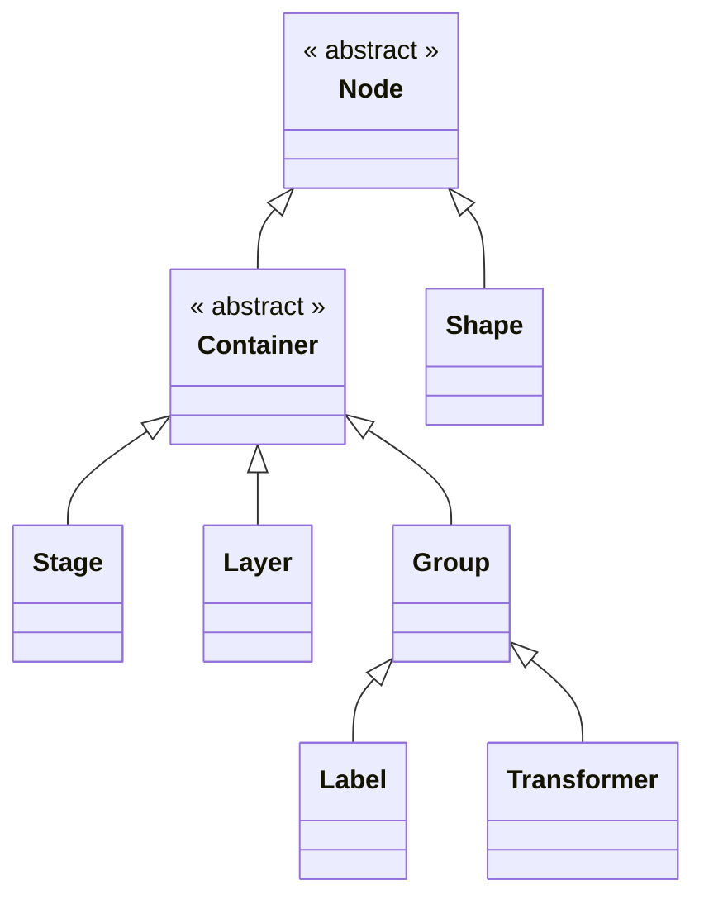

# 类继承关系

继承自 Shape 的类包括：

- `Arc`: 圆弧
- `Circle`: 圆
- `Ellipse`: 椭圆
- `Image`: 图片
- `Line`: 线
  - `Arrow`: 箭头
- `Path`: 路径
- `Rect`: 矩形
- `RegularPolygon`: 正多边形
- `Ring`: 圆环
- `Sprite`: 精灵动画
- `Star`: 星形
- `Tag`: 标签背景
- `Text`: 文本
