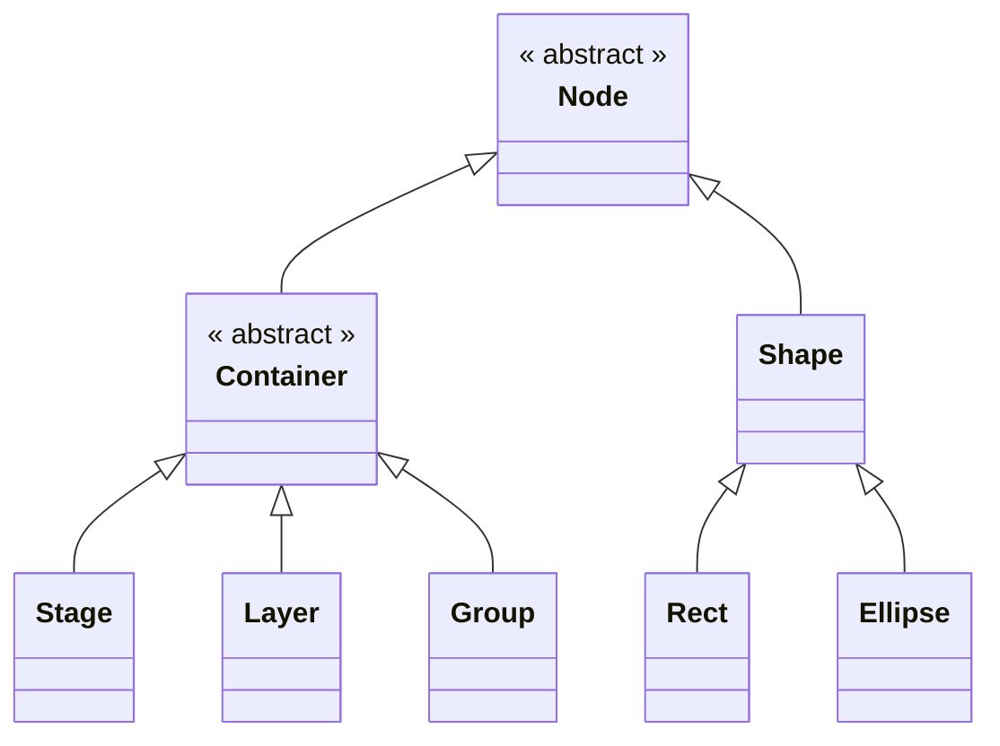

# 类继承关系

```mermaid
classDiagram

class Node {
    << abstract >>
}
link Node "../api/node"

class Container {
    << abstract >>
}
link Container "../api/container"

class Stage {
}
link Stage "../api/stage"

class Layer {
}
link Layer "../api/layer"

class Group {
}
link Group "../api/group"

class Shape {
}
link Shape "../api/shape"

class Rect {}
link Rect "../api/rect"

class Ellipse {}
link Ellipse "../api/ellipse"


Node <|-- Container
Node <|-- Shape
Container <|-- Stage
Container <|-- Layer
Container <|-- Group
Shape <|-- Rect
Shape <|-- Ellipse
```
