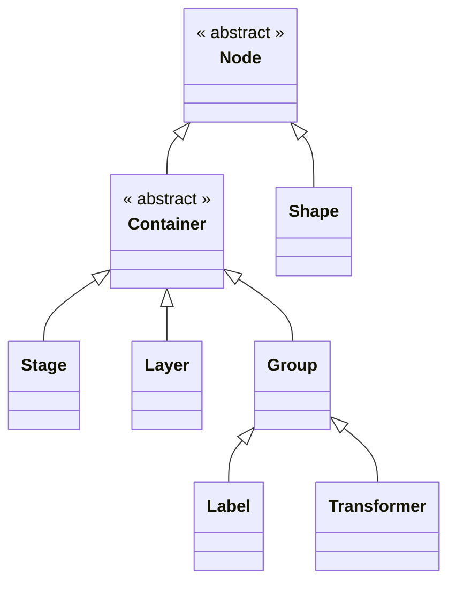

# 类继承关系

```mermaid
classDiagram

class Node {
    << abstract >>
}
link Node "../api/node"

class Container {
    << abstract >>
}
link Container "../api/container"

class Stage {
}
link Stage "../api/stage"

class Layer {
}
link Layer "../api/layer"

class Group {
}
link Group "../api/group"

class Label {
}
link Label "../api/label"

class Transformer {
}
link Transformer "../api/transformer"

class Shape {
}
link Shape "../api/shape"


Node <|-- Container
Node <|-- Shape
Container <|-- Stage
Container <|-- Layer
Container <|-- Group
Group <|-- Label
Group <|-- Transformer
```

继承自 Shape 的类包括：

- `Arc`
- `Circle`
- `Ellipse`
- `Image`
- `Line`
  - `Arrow`
- `Tag`
- `Text`
